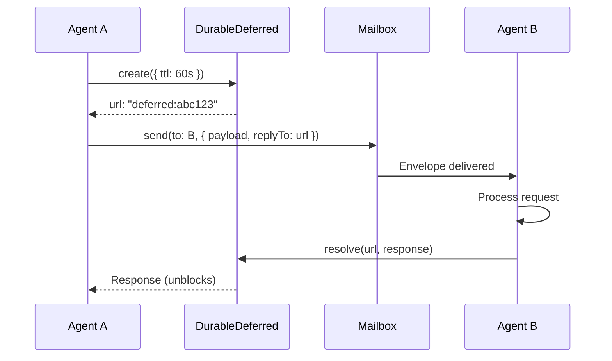

# Swarm Mail Architecture

```
                                  _.------._
                                .'   .--.   '.        🐝
                               /   .'    '.   \    🐝
                              |   /   __   \   |      🐝
    🐝                        |  |   (  )   |  |  🐝
         🐝    _  _           |  |   |__|   |  |
              ( \/ )           \  '.      .'  /    🐝
    🐝    ____/    \____        '.  '----'  .'
        /    \    /    \         '-._____.-'           🐝
       /  ()  \  /  ()  \
      |   /\   ||   /\   |     ███████╗██╗    ██╗ █████╗ ██████╗ ███╗   ███╗
      |  /__\  ||  /__\  |     ██╔════╝██║    ██║██╔══██╗██╔══██╗████╗ ████║
       \      /  \      /      ███████╗██║ █╗ ██║███████║██████╔╝██╔████╔██║
    🐝  '----'    '----'       ╚════██║██║███╗██║██╔══██║██╔══██╗██║╚██╔╝██║
                               ███████║╚███╔███╔╝██║  ██║██║  ██║██║ ╚═╝ ██║
          🐝                   ╚══════╝ ╚══╝╚══╝ ╚═╝  ╚═╝╚═╝  ╚═╝╚═╝     ╚═╝
                 🐝
    🐝                         ███╗   ███╗ █████╗ ██╗██╗
                               ████╗ ████║██╔══██╗██║██║         🐝
         🐝                    ██╔████╔██║███████║██║██║
                               ██║╚██╔╝██║██╔══██║██║██║    🐝
    🐝        🐝               ██║ ╚═╝ ██║██║  ██║██║███████╗
                               ╚═╝     ╚═╝╚═╝  ╚═╝╚═╝╚══════╝       🐝
              🐝
                          ⚡ Actor-Model Primitives for Agent Coordination ⚡
```

## Overview

**Swarm Mail** is an embedded, event-sourced messaging system for multi-agent coordination. Built on **Durable Streams** primitives with Effect-TS, it provides actor-model communication without external server dependencies.

### What Problem Does It Solve?

When multiple AI agents work on the same codebase in parallel, they need to:

- **Coordinate file access** - prevent edit conflicts via reservations
- **Exchange messages** - async communication for status, blockers, handoffs
- **Request/response** - synchronous-style RPC for data queries
- **Resume after crashes** - positioned consumption with checkpointing
- **Audit all actions** - full event history for debugging and learning

Traditional solutions require external servers (Redis, Kafka, NATS). Swarm Mail is **embedded** - just PGLite (embedded Postgres) + Effect-TS.

### Key Features

- ✅ **Local-first** - No external servers, no network dependencies
- ✅ **Event-sourced** - Full audit trail of all agent actions
- ✅ **Resumable** - Checkpointed cursors for exactly-once processing
- ✅ **Type-safe** - Effect-TS with full type inference
- ✅ **Actor-model** - Mailboxes, envelopes, distributed promises
- ✅ **File safety** - CAS-based locks for mutual exclusion

---

## Architecture Stack

Swarm Mail is built in **3 tiers** - primitives, patterns, and coordination layers.

```
┌─────────────────────────────────────────────────────────────────────────────┐
│                              SWARM MAIL STACK                               │
├─────────────────────────────────────────────────────────────────────────────┤
│                                                                             │
│   TIER 3: COORDINATION                                                      │
│   ┌─────────────────────────────────────────────────────────────────────┐   │
│   │  ask<Req, Res>() - Request/Response over Streams (RPC-style)        │   │
│   └─────────────────────────────────────────────────────────────────────┘   │
│                                      │                                      │
│   TIER 2: PATTERNS                   ▼                                      │
│   ┌───────────────────────┐    ┌───────────────────────┐                    │
│   │    DurableMailbox     │    │     DurableLock       │                    │
│   │  Actor Inbox + Reply  │    │  CAS Mutual Exclusion │                    │
│   └───────────────────────┘    └───────────────────────┘                    │
│              │                           │                                  │
│   TIER 1: PRIMITIVES                     ▼                                  │
│   ┌───────────────────────┐    ┌───────────────────────┐                    │
│   │    DurableCursor      │    │   DurableDeferred     │                    │
│   │  Checkpointed Reader  │    │  Distributed Promise  │                    │
│   └───────────────────────┘    └───────────────────────┘                    │
│                                      │                                      │
│   STORAGE                            ▼                                      │
│   ┌─────────────────────────────────────────────────────────────────────┐   │
│   │              PGLite (Embedded Postgres) + Migrations                │   │
│   └─────────────────────────────────────────────────────────────────────┘   │
│                                                                             │
└─────────────────────────────────────────────────────────────────────────────┘
```

---

## Tier 1: Durable Streams Primitives

The foundational building blocks. Inspired by Kyle Matthews' [Durable Streams protocol](https://x.com/kylemathews/status/1999896667030700098).

### DurableCursor - Positioned Event Stream Consumption

**Purpose:** Read events from a stream with resumable position tracking.

**Key Concept:** Event streams are append-only logs. Cursors track the "last read position" (sequence number) and checkpoint it to the database. If an agent crashes, it resumes from the last committed position.

**API:**

```typescript
const cursor =
  yield *
  cursorService.create({
    stream: "projects/foo/events", // Stream identifier
    checkpoint: "agents/bar/position", // Unique checkpoint name
    batchSize: 100, // Read 100 events at a time
  });

// Consume events as async iterable
for await (const msg of cursor.consume()) {
  yield * handleMessage(msg.value);
  yield * msg.commit(); // Checkpoint this position
}
```

**Implementation Details:**

- **Schema:** `cursors` table with `(stream, checkpoint)` UNIQUE constraint
- **Batching:** Reads events in batches (default 100) for efficiency
- **Commit:** Updates `position` in database + in-memory `Ref`
- **Resumability:** On restart, loads last committed position from DB

**Use Cases:**

- Inbox consumption - agent reads messages from stream
- Event processing - workers consume tasks from event log
- Exactly-once semantics - commit after processing, skip on replay

---

### DurableDeferred - Distributed Promises

**Purpose:** Create a "distributed promise" that can be resolved from anywhere (think of it as a URL-addressable future value).

**Key Concept:** You create a deferred with a unique URL, pass that URL to another agent, and block waiting for the response. The other agent resolves the deferred by URL, unblocking you.

**API:**

```typescript
// Agent A: Create deferred and send request
const deferred =
  yield *
  deferredService.create<Response>({
    ttlSeconds: 60,
  });

yield *
  mailbox.send("agent-b", {
    payload: { task: "getData" },
    replyTo: deferred.url, // URL like "deferred:abc123"
  });

const response = yield * deferred.value; // Blocks until resolved or timeout

// Agent B: Resolve deferred
yield * deferredService.resolve(envelope.replyTo, { data: "result" });
```

**Implementation Details:**

- **Schema:** `deferred` table with `url UNIQUE`, `resolved BOOLEAN`, `value JSONB`
- **In-memory registry:** `Map<url, Effect.Deferred>` for instant resolution (no polling)
- **Fallback polling:** If in-memory deferred missing (agent restart), polls database every 100ms
- **TTL expiry:** Auto-cleanup of expired deferreds
- **Errors:** `TimeoutError` if TTL expires, `NotFoundError` if URL doesn't exist

**Use Cases:**

- Request/response - ask pattern (see Tier 3)
- RPC over streams - synchronous-style calls between agents
- Coordination - agent waits for signal from another agent

---

### DurableLock - Distributed Mutual Exclusion

**Purpose:** Acquire exclusive locks on resources using Compare-And-Swap (CAS) pattern.

**Key Concept:** CAS (seq=0) pattern - try to INSERT (no lock exists) or UPDATE (lock expired or we already hold it). Uses exponential backoff for retries on contention.

**API:**

```typescript
// Acquire lock with retry
const lock =
  yield *
  lockService.acquire("my-resource", {
    ttlSeconds: 30,
    maxRetries: 10,
  });

try {
  // Critical section - only one agent here at a time
  yield * doWork();
} finally {
  yield * lock.release();
}

// Or use helper
yield * lockService.withLock("my-resource", Effect.succeed(42));
```

**Implementation Details:**

- **Schema:** `locks` table with `resource UNIQUE`, `holder TEXT`, `seq INTEGER`
- **CAS logic:**
  1. Try `INSERT` (no lock exists) → success
  2. If INSERT fails, try `UPDATE WHERE expires_at < now OR holder = me` → success if stale/reentrant
  3. If UPDATE returns 0 rows → contention, retry with backoff
- **Exponential backoff:** 50ms base delay, doubles each retry (50ms, 100ms, 200ms...)
- **Auto-expiry:** TTL stored in `expires_at`, stale locks can be claimed
- **Errors:** `LockTimeout` if max retries exceeded, `LockNotHeld` if release by wrong holder

**Use Cases:**

- File reservations - prevent edit conflicts (Swarm Mail uses this)
- Critical sections - only one agent modifying shared state
- Leader election - first to acquire lock becomes leader

---

### DurableMailbox - Actor-Style Messaging

**Purpose:** Send/receive envelopes between agents using cursor-based positioned consumption.

**Key Concept:** Combines DurableCursor (positioned reading) + Envelope pattern (payload + metadata). Each agent has a named mailbox, messages are filtered by recipient during consumption.

**API:**

```typescript
const mailbox =
  yield *
  mailboxService.create({
    agent: "worker-1",
    projectKey: "proj-123",
  });

// Send message with optional reply channel
yield *
  mailbox.send("worker-2", {
    payload: { task: "process-data" },
    replyTo: "deferred:xyz", // For request/response
    threadId: "bd-123", // Conversation tracking
  });

// Receive messages (filters to only messages for this agent)
for await (const envelope of mailbox.receive()) {
  console.log(envelope.payload);
  if (envelope.replyTo) {
    yield * DurableDeferred.resolve(envelope.replyTo, result);
  }
  yield * envelope.commit(); // Checkpoint position
}
```

**Implementation Details:**

- **Cursor creation:** Creates `DurableCursor` with filter `types: ["message_sent"]`
- **Filtering:** `eventToEnvelope()` skips messages not addressed to this agent
- **Envelope structure:**
  ```typescript
  {
    payload: T,           // Your message data
    replyTo?: string,     // Deferred URL for response
    sender: string,       // From agent
    messageId: number,    // Message ID
    threadId?: string,    // Conversation grouping
    commit: () => Effect  // Checkpoint this message
  }
  ```
- **Storage:** Messages stored as `message_sent` events in event stream

**Use Cases:**

- Agent inbox - receive tasks, status updates, blockers
- Broadcast - send message to multiple agents
- Request/response - combine with DurableDeferred (see ask pattern)

---

## Tier 2: Coordination Patterns

Higher-level patterns built by composing primitives.

### The Ask Pattern - Request/Response over Streams

**Purpose:** Synchronous-style RPC between agents using async streams.

**How It Works:**

```
┌─────────┐                                                  ┌─────────┐
│ Agent A │                                                  │ Agent B │
└────┬────┘                                                  └────┬────┘
     │                                                            │
     │ 1. Create deferred                                        │
     │    url = "deferred:abc123"                                │
     │                                                            │
     │ 2. Send message with replyTo=url                          │
     ├──────────────────────────────────────────────────────────>│
     │                                                            │
     │ 3. Block on deferred.value                                │ 4. Process request
     │    (waits...)                                             │
     │                                                            │
     │                                   5. Resolve deferred(url) │
     │<───────────────────────────────────────────────────────────┤
     │                                                            │
     │ 6. Unblocked, return response                             │
     │                                                            │
```

**Code Example:**

```typescript
// Agent A (caller)
const response =
  yield *
  ask<Request, Response>({
    mailbox: myMailbox,
    to: "worker-2",
    payload: { query: "getUserData", userId: 123 },
    ttlSeconds: 30,
  });

// Agent B (responder)
for await (const envelope of mailbox.receive()) {
  const result = processRequest(envelope.payload);
  if (envelope.replyTo) {
    yield * DurableDeferred.resolve(envelope.replyTo, result);
  }
  yield * envelope.commit();
}
```

**Why This Matters:**

- **Synchronous feel, async reality** - code looks like RPC, but it's event-driven
- **Resilient** - if responder crashes, caller gets timeout (not hung forever)
- **Auditable** - all request/response pairs in event log
- **Type-safe** - full TypeScript inference for request/response types

---

### File Reservation Protocol

**Purpose:** Prevent edit conflicts when multiple agents modify files.

**Flow:**

```
┌──────────┐                                          ┌──────────┐
│ Agent A  │                                          │ Agent B  │
└────┬─────┘                                          └────┬─────┘
     │                                                     │
     │ 1. Reserve src/auth.ts (exclusive)                 │
     ├────────────────────────────────────────────┐       │
     │                                            │       │
     │ 2. DurableLock.acquire("src/auth.ts")     │       │
     │    → Granted (no conflicts)                │       │
     │                                            │       │
     │ 3. Edit src/auth.ts                        │       │
     │                                            │       │ 4. Reserve src/auth.ts
     │                                            │       ├──────────────────────┐
     │                                            │       │                      │
     │                                            │       │ 5. Lock contention   │
     │                                            │       │    → Warned (Agent A │
     │                                            │       │       holds lock)    │
     │                                            │       │                      │
     │ 6. Release src/auth.ts                     │       │                      │
     ├────────────────────────────────────────────┤       │                      │
     │                                            │       │                      │
     │ 7. DurableLock.release()                   │       │ 8. Retry acquire     │
     │                                            │       │    → Granted         │
     │                                            │       │                      │
```

**Implementation:**

- Uses `DurableLock` for mutual exclusion
- Conflicts are **warnings**, not blockers (agents can proceed with awareness)
- TTL expiry (default 1 hour) prevents deadlocks from crashed agents
- Materialized view (`reservations` table) for fast conflict queries

---

## Tier 3: High-Level APIs

The public API exposed to agents (wraps primitives + patterns).

### Swarm Mail API

These are the functions called by agents (via plugin tools or direct import):

```typescript
// Initialization
const { agentName, projectKey } = await initSwarmAgent({
  projectPath: "/abs/path",
  agentName: "BlueLake", // Optional, auto-generated if omitted
  taskDescription: "Implementing auth",
});

// Send message
await sendSwarmMessage({
  projectPath,
  fromAgent: "BlueLake",
  toAgents: ["coordinator"],
  subject: "Progress: bd-123.2",
  body: "Auth service complete",
  threadId: "bd-123",
  importance: "normal",
});

// Read inbox
const { messages } = await getSwarmInbox({
  projectPath,
  agentName: "BlueLake",
  limit: 5, // Max 5 (hard cap for context)
  urgentOnly: false,
  includeBodies: false, // Headers only by default
});

// Read full message
const message = await readSwarmMessage({
  projectPath,
  messageId: 123,
  markAsRead: true,
});

// Reserve files
const { granted, conflicts } = await reserveSwarmFiles({
  projectPath,
  agentName: "BlueLake",
  paths: ["src/auth/**"],
  reason: "bd-123.2: Auth service",
  exclusive: true,
  ttlSeconds: 3600,
});

// Release files
await releaseSwarmFiles({
  projectPath,
  agentName: "BlueLake",
  paths: ["src/auth/**"],
});
```

---

## Event Sourcing Architecture

Swarm Mail is fully event-sourced. **All state changes are events first, materialized views second.**

### Event Flow

```
┌─────────────┐
│   Action    │  Agent calls API (e.g., sendMessage)
└──────┬──────┘
       │
       ▼
┌─────────────┐
│   Create    │  createEvent("message_sent", {...})
│   Event     │  Returns: { type, timestamp, ...payload }
└──────┬──────┘
       │
       ▼
┌─────────────┐
│   Append    │  appendEvent() → INSERT INTO events
│   to Log    │  Gets auto-increment id + sequence
└──────┬──────┘
       │
       ▼
┌─────────────┐
│   Update    │  updateProjections() triggers based on event type
│   Views     │  - message_sent → INSERT messages, UPDATE agent read status
└──────┬──────┘  - file_reserved → INSERT reservations
       │         - message_read → UPDATE message read flags
       ▼
┌─────────────┐
│   Query     │  getInbox(), getMessage(), getReservations()
│   Views     │  Fast queries on materialized tables
└─────────────┘
```

### Event Types

| Event Type         | Trigger                      | Projections Updated              |
| ------------------ | ---------------------------- | -------------------------------- |
| `agent_registered` | Agent init                   | `agents` table                   |
| `message_sent`     | sendMessage()                | `messages`, `message_recipients` |
| `message_read`     | readMessage(markAsRead=true) | `messages.read_by` JSONB         |
| `message_acked`    | acknowledgeMessage()         | `messages.acked_by` JSONB        |
| `file_reserved`    | reserveFiles()               | `reservations`                   |
| `file_released`    | releaseFiles()               | `reservations` (DELETE expired)  |

### Why Event Sourcing?

- ✅ **Full audit trail** - every agent action is logged forever
- ✅ **Time travel** - replay events to reconstruct past state
- ✅ **Debugging** - when agents conflict, trace exact sequence of events
- ✅ **Learning** - analyze event patterns to improve swarm strategies
- ✅ **Resumability** - cursors checkpoint position, replay from there on crash

---

## Comparison to Agent Mail

Swarm Mail is **inspired by** [Agent Mail](https://github.com/sst/opencode) (SST's multi-agent coordination layer) but built from scratch with different trade-offs.

| Aspect                   | Agent Mail (SST)              | Swarm Mail (This Plugin)               |
| ------------------------ | ----------------------------- | -------------------------------------- |
| **Architecture**         | MCP server (external process) | Embedded (PGLite in-process)           |
| **Storage**              | SQLite file                   | PGLite (WASM Postgres)                 |
| **Dependencies**         | Requires MCP server running   | Zero external deps, just npm install   |
| **Effect-TS**            | No                            | Yes (full Effect integration)          |
| **Event Sourcing**       | No (CRUD operations)          | Yes (append-only event log)            |
| **Cursors**              | No (queries are one-shot)     | Yes (resumable positioned consumption) |
| **Distributed Promises** | No                            | Yes (DurableDeferred)                  |
| **Type Safety**          | MCP JSON-RPC (strings)        | Full TypeScript + Zod validation       |
| **Local-First**          | Requires server               | True local-first (no network)          |
| **Learning System**      | No                            | Yes (eval records, pattern maturity)   |

**When to Use Agent Mail:**

- You're already using OpenCode with MCP infrastructure
- You need cross-project coordination (multiple repos)
- You want battle-tested SST ecosystem integration

**When to Use Swarm Mail:**

- You want embedded, zero-config coordination
- You're building Effect-TS applications
- You need event sourcing and audit trails
- You want resumable cursors for exactly-once semantics
- You're using this plugin's learning/swarm features

---

## Database Schema

Swarm Mail uses **PGLite** (embedded Postgres compiled to WASM). Schema is managed via migrations (see `src/streams/migrations.ts`).

### Core Tables

#### `events` - Append-Only Event Log

```sql
CREATE TABLE events (
  id SERIAL PRIMARY KEY,
  sequence SERIAL,              -- Auto-increment, never gaps
  type TEXT NOT NULL,           -- Event type (message_sent, file_reserved, etc.)
  timestamp BIGINT NOT NULL,    -- Unix timestamp in ms
  payload JSONB NOT NULL,       -- Event-specific data
  project_key TEXT NOT NULL,
  agent_name TEXT
);
CREATE INDEX idx_events_sequence ON events(sequence);
CREATE INDEX idx_events_type ON events(type);
CREATE INDEX idx_events_project ON events(project_key);
```

**All state changes flow through this table.** Other tables are materialized views.

---

#### `cursors` - Checkpointed Read Positions

```sql
CREATE TABLE cursors (
  id SERIAL PRIMARY KEY,
  stream TEXT NOT NULL,         -- Stream name (e.g., "projects/foo/events")
  checkpoint TEXT NOT NULL,     -- Checkpoint name (e.g., "agents/bar/position")
  position BIGINT NOT NULL,     -- Last committed sequence number
  updated_at BIGINT NOT NULL,
  UNIQUE(stream, checkpoint)
);
CREATE INDEX idx_cursors_checkpoint ON cursors(checkpoint);
```

**DurableCursor uses this to resume from last position after restart.**

---

#### `deferred` - Distributed Promises

```sql
CREATE TABLE deferred (
  id SERIAL PRIMARY KEY,
  url TEXT NOT NULL UNIQUE,     -- Unique identifier (e.g., "deferred:abc123")
  resolved BOOLEAN NOT NULL DEFAULT FALSE,
  value JSONB,                  -- Resolution value
  error TEXT,                   -- Rejection error message
  expires_at BIGINT NOT NULL,   -- TTL expiry timestamp
  created_at BIGINT NOT NULL
);
CREATE INDEX idx_deferred_url ON deferred(url);
CREATE INDEX idx_deferred_expires ON deferred(expires_at);
```

**DurableDeferred uses this for URL-addressable futures.**

---

#### `locks` - CAS-Based Mutual Exclusion

```sql
CREATE TABLE locks (
  id SERIAL PRIMARY KEY,
  resource TEXT NOT NULL UNIQUE, -- Resource being locked
  holder TEXT NOT NULL,           -- Agent holding lock
  seq INTEGER NOT NULL,           -- CAS sequence number
  acquired_at BIGINT NOT NULL,
  expires_at BIGINT NOT NULL,
  UNIQUE(resource)
);
```

**DurableLock uses this for file reservations and critical sections.**

---

#### `messages` - Materialized Message View

```sql
CREATE TABLE messages (
  id SERIAL PRIMARY KEY,
  project_key TEXT NOT NULL,
  from_agent TEXT NOT NULL,
  subject TEXT NOT NULL,
  body TEXT NOT NULL,
  thread_id TEXT,
  importance TEXT DEFAULT 'normal',
  created_at BIGINT NOT NULL,
  read_by JSONB DEFAULT '[]',   -- Array of agent names who read it
  acked_by JSONB DEFAULT '[]'   -- Array of agent names who acked it
);
```

**Built from `message_sent`, `message_read`, `message_acked` events.**

---

#### `message_recipients` - Message Routing

```sql
CREATE TABLE message_recipients (
  id SERIAL PRIMARY KEY,
  message_id INTEGER NOT NULL REFERENCES messages(id),
  agent_name TEXT NOT NULL,
  UNIQUE(message_id, agent_name)
);
CREATE INDEX idx_message_recipients_agent ON message_recipients(agent_name);
```

**Tracks which agents should see which messages (for inbox filtering).**

---

#### `reservations` - Active File Locks

```sql
CREATE TABLE reservations (
  id SERIAL PRIMARY KEY,
  project_key TEXT NOT NULL,
  agent_name TEXT NOT NULL,
  path_pattern TEXT NOT NULL,   -- File path or glob pattern
  exclusive BOOLEAN NOT NULL,
  reason TEXT,
  expires_at BIGINT NOT NULL
);
CREATE INDEX idx_reservations_agent ON reservations(agent_name);
CREATE INDEX idx_reservations_path ON reservations(path_pattern);
```

**Built from `file_reserved` events, expired entries removed by `file_released`.**

---

### Migrations

Schema versioning via `migrations.ts`:

```typescript
export const migrations: Migration[] = [
  {
    version: 1,
    description: "Add cursors table for DurableCursor",
    up: `CREATE TABLE cursors (...)`,
    down: `DROP TABLE cursors`,
  },
  {
    version: 2,
    description: "Add deferred table for DurableDeferred",
    up: `CREATE TABLE deferred (...)`,
    down: `DROP TABLE deferred`,
  },
  // ... more migrations
];
```

**Migrations run automatically on first database access.** New migrations are applied in order, version tracked in `schema_version` table.

---

## Effect-TS Integration

Swarm Mail is **built with Effect** - a functional effect system for TypeScript.

### Why Effect?

- ✅ **Composability** - combine primitives into patterns without callback hell
- ✅ **Type inference** - full TypeScript inference for errors and dependencies
- ✅ **Retries** - built-in retry schedules with exponential backoff
- ✅ **Resource safety** - `Effect.ensuring` guarantees cleanup (like try/finally)
- ✅ **Dependency injection** - Layers for services, no globals

### Services and Layers

Each primitive is an Effect **Service** (via `Context.Tag`):

```typescript
// Define service interface
export class DurableCursor extends Context.Tag("DurableCursor")<
  DurableCursor,
  DurableCursorService
>() {}

// Implement service
export const DurableCursorLive = DurableCursor.of({
  create: createCursorImpl,
});

// Use service in Effect
const program = Effect.gen(function* () {
  const cursor = yield* DurableCursor; // Service dependency
  const consumer = yield* cursor.create({ stream: "..." });
  // ...
});

// Provide service implementation
Effect.runPromise(program.pipe(Effect.provide(DurableCursorLive)));
```

**Layers compose** - higher-level services depend on lower-level ones:

```typescript
// DurableMailbox depends on DurableCursor
const MailboxLayer = Layer.mergeAll(CursorLayer, DurableMailboxLive);

// Ask pattern depends on Mailbox + Deferred
export const DurableAskLive = Layer.mergeAll(DurableDeferredLive, MailboxLayer);

// Use in program
const program = Effect.gen(function* () {
  const mailbox = yield* DurableMailbox;
  const response = yield* ask({ mailbox, to: "worker-2", payload: {...} });
});

Effect.runPromise(program.pipe(Effect.provide(DurableAskLive)));
```

### Error Handling

Effect has **typed errors** - errors are part of the Effect signature:

```typescript
// Effect<Success, Error, Requirements>
type MyEffect = Effect.Effect<number, LockError | TimeoutError, DurableLock>;

// Handle specific error types
yield *
  lockService.acquire("resource").pipe(
    Effect.catchTag("LockTimeout", () => Effect.succeed(null)),
    Effect.catchTag("LockContention", () => Effect.fail(new MyError())),
  );
```

---

## Use Cases and Examples

### Example 1: Swarm Worker Agent

**Scenario:** Worker agent receives subtask, reserves files, reports progress, completes.

```typescript
import { Effect } from "effect";
import { DurableAskLive } from "./streams/effect/layers";
import {
  initSwarmAgent,
  sendSwarmMessage,
  reserveSwarmFiles,
} from "./swarm-mail";

const program = Effect.gen(function* () {
  // 1. Initialize agent
  const { agentName, projectKey } = yield* Effect.promise(() =>
    initSwarmAgent({
      projectPath: "/abs/path",
      taskDescription: "bd-123.2: Auth service",
    }),
  );

  console.log(`Agent: ${agentName}`); // e.g., "DarkStone"

  // 2. Reserve files
  const { granted, conflicts } = yield* Effect.promise(() =>
    reserveSwarmFiles({
      projectPath: projectKey,
      agentName,
      paths: ["src/auth/**"],
      reason: "bd-123.2: Auth service",
      exclusive: true,
    }),
  );

  if (conflicts.length > 0) {
    console.warn("File conflicts detected:", conflicts);
  }

  // 3. Report progress
  yield* Effect.promise(() =>
    sendSwarmMessage({
      projectPath: projectKey,
      fromAgent: agentName,
      toAgents: ["coordinator"],
      subject: "Progress: bd-123.2",
      body: "Reserved files, starting work",
      threadId: "bd-123",
      importance: "normal",
    }),
  );

  // 4. Do work...
  yield* Effect.sleep("5 seconds");

  // 5. Report completion
  yield* Effect.promise(() =>
    sendSwarmMessage({
      projectPath: projectKey,
      fromAgent: agentName,
      toAgents: ["coordinator"],
      subject: "Complete: bd-123.2",
      body: "Auth service implemented",
      threadId: "bd-123",
      importance: "high",
    }),
  );
});

Effect.runPromise(program.pipe(Effect.provide(DurableAskLive)));
```

---

### Example 2: Request/Response with Ask Pattern

**Scenario:** Agent A asks Agent B for data, blocks until response.

```typescript
import { ask, respond } from "./streams/effect/ask";
import { DurableAskLive } from "./streams/effect/layers";

// Agent A (requester)
const agentA = Effect.gen(function* () {
  const mailboxService = yield* DurableMailbox;
  const mailbox = yield* mailboxService.create({
    agent: "agent-a",
    projectKey: "proj",
  });

  console.log("Requesting user data...");

  const response = yield* ask<Request, Response>({
    mailbox,
    to: "agent-b",
    payload: { userId: 123 },
    ttlSeconds: 30,
  });

  console.log("Got response:", response);
});

// Agent B (responder)
const agentB = Effect.gen(function* () {
  const mailboxService = yield* DurableMailbox;
  const mailbox = yield* mailboxService.create({
    agent: "agent-b",
    projectKey: "proj",
  });

  console.log("Listening for requests...");

  for await (const envelope of mailbox.receive<Request>()) {
    console.log("Processing request:", envelope.payload);

    const result = { name: "John", id: envelope.payload.userId };

    yield* respond(envelope, result);
    yield* envelope.commit();
  }
});

// Run both agents in parallel
const program = Effect.all([agentA, agentB], { concurrency: "unbounded" });
Effect.runPromise(program.pipe(Effect.provide(DurableAskLive)));
```

---

### Example 3: Resumable Event Processing

**Scenario:** Worker consumes events, checkpoints position, resumes after crash.

```typescript
import { DurableCursor } from "./streams/effect/cursor";
import { DurableCursorLive } from "./streams/effect/layers";

const program = Effect.gen(function* () {
  const cursorService = yield* DurableCursor;

  const cursor = yield* cursorService.create({
    stream: "projects/foo/events",
    checkpoint: "workers/event-processor",
    batchSize: 50,
  });

  console.log("Starting from position:", yield* cursor.getPosition());

  for await (const msg of cursor.consume()) {
    console.log("Processing event:", msg.value);

    // Simulate processing
    yield* Effect.sleep("100 millis");

    // Checkpoint position
    yield* msg.commit();
  }
});

Effect.runPromise(program.pipe(Effect.provide(DurableCursorLive)));

// If this crashes, next run starts from last committed position
```

---

## Diagrams

### Message Flow Between Agents

```
┌───────────┐                    ┌──────────────┐                    ┌───────────┐
│  Agent A  │                    │ Event Stream │                    │  Agent B  │
└─────┬─────┘                    └──────┬───────┘                    └─────┬─────┘
      │                                 │                                  │
      │ 1. Send message                 │                                  │
      ├────────────────────────────────>│                                  │
      │    { to: "agent-b",             │ 2. Append message_sent event     │
      │      payload: {...} }           │    (id=42, seq=100)              │
      │                                 │                                  │
      │                                 │ 3. Update message view           │
      │                                 │    INSERT INTO messages (...)    │
      │                                 │                                  │
      │                                 │                                  │
      │                                 │         4. Agent B consumes      │
      │                                 │<─────────────────────────────────┤
      │                                 │    DurableCursor.consume()       │
      │                                 │    afterSequence=99              │
      │                                 │                                  │
      │                                 │ 5. Return events                 │
      │                                 ├─────────────────────────────────>│
      │                                 │    [{ seq=100, type=msg_sent }]  │
      │                                 │                                  │
      │                                 │    6. Process message            │
      │                                 │<─────────────────────────────────┤
      │                                 │       msg.commit()               │
      │                                 │                                  │
      │                                 │ 7. Checkpoint position=100       │
      │                                 │<─────────────────────────────────┤
      │                                 │                                  │
```

---

### File Reservation Protocol (CAS Lock)

```
┌──────────┐                                          ┌──────────┐
│ Agent A  │                                          │ Agent B  │
└────┬─────┘                                          └────┬─────┘
     │                                                     │
     │ 1. Reserve src/auth.ts                             │
     ├─────────────────────────────┐                      │
     │                             │                      │
     │ 2. DurableLock.acquire()    │                      │
     │    INSERT INTO locks        │                      │
     │    VALUES ('src/auth.ts',   │                      │
     │            'AgentA',         │                      │
     │            seq=0)            │                      │
     │    → SUCCESS                 │                      │
     │                             │                      │
     │ 3. Edit src/auth.ts         │                      │
     │                             │                      │
     │                             │    4. Reserve src/auth.ts
     │                             │    ├──────────────────────┐
     │                             │    │                      │
     │                             │    │ 5. TRY INSERT        │
     │                             │    │    → CONFLICT        │
     │                             │    │                      │
     │                             │    │ 6. TRY UPDATE        │
     │                             │    │    WHERE expires_at  │
     │                             │    │    < now OR          │
     │                             │    │    holder='AgentB'   │
     │                             │    │    → 0 rows          │
     │                             │    │                      │
     │                             │    │ 7. Retry with        │
     │                             │    │    exponential       │
     │                             │    │    backoff...        │
     │                             │    │                      │
     │ 8. Release lock             │    │                      │
     ├─────────────────────────────┤    │                      │
     │                             │    │                      │
     │ 9. DELETE FROM locks        │    │ 10. Retry succeeds   │
     │    WHERE resource=...       │    │     UPDATE (0 rows   │
     │    AND holder='AgentA'      │    │     before, now      │
     │                             │    │     lock is free)    │
     │                             │    │     → SUCCESS        │
     │                             │    │                      │
```

---

### Ask Pattern (Request/Response)



---

### Event Stream Structure

```
events table (append-only log):

┌────┬──────────┬──────────────┬───────────────┬─────────────────────────────┐
│ id │ sequence │     type     │   timestamp   │           payload           │
├────┼──────────┼──────────────┼───────────────┼─────────────────────────────┤
│  1 │    1     │ agent_reg... │ 1704000000000 │ { agent: "AgentA", ... }    │
│  2 │    2     │ message_sent │ 1704000001000 │ { from: "A", to: ["B"] }    │
│  3 │    3     │ file_reserv. │ 1704000002000 │ { agent: "A", paths: [...]} │
│  4 │    4     │ message_read │ 1704000003000 │ { message_id: 2, agent: "B"}│
│  5 │    5     │ file_releas. │ 1704000004000 │ { agent: "A", paths: [...]} │
└────┴──────────┴──────────────┴───────────────┴─────────────────────────────┘
                                     ▲
                                     │
                                     │  DurableCursor reads from here
                                     │  Checkpoints last sequence number
                                     │
                             ┌───────────────────┐
                             │  cursors table    │
                             ├───────────────────┤
                             │ checkpoint: "..."  │
                             │ position: 4       │ ← Resume from seq=5
                             └───────────────────┘
```

---

## Credits and Inspiration

- **[Kyle Matthews](https://twitter.com/kylemathews)** (Founder/CPO @ [Electric SQL](https://electric-sql.com/)) - The Durable Streams protocol and the insight that composable primitives can build powerful actor systems. [Original tweet](https://x.com/kylemathews/status/1999896667030700098)
- **[Agent Mail](https://github.com/sst/opencode)** - Multi-agent coordination layer for OpenCode (SST). Swarm Mail's API surface is heavily inspired by Agent Mail's design.
- **[Electric SQL](https://electric-sql.com/)** - Real-time sync engine for Postgres. The cursor pattern and positioned consumption ideas come from Electric's sync protocol.
- **[Effect-TS](https://effect.website/)** - Functional effect system powering the implementation. Effect's composability and type safety make the primitives ergonomic.

---

## What's Next?

Swarm Mail is **production-ready** but has room for optimization:

### Performance Improvements

- [ ] **LISTEN/NOTIFY** - replace deferred polling with Postgres LISTEN/NOTIFY for instant wakeup
- [ ] **Connection pooling** - reuse PGLite connections instead of opening new ones
- [ ] **Batch inserts** - batch multiple events into one transaction
- [ ] **Index tuning** - add covering indexes for hot queries

### Features

- [ ] **Message priorities** - priority queue for urgent messages
- [ ] **Dead letter queue** - failed messages go to DLQ for retry
- [ ] **Message TTL** - auto-expire old messages
- [ ] **Broadcast channels** - pub/sub for topic-based routing
- [ ] **Saga pattern** - distributed transactions with compensations

### Developer Experience

- [ ] **DevTools UI** - web UI for inspecting events, cursors, locks
- [ ] **CLI tools** - `swarm-mail inspect`, `swarm-mail replay`
- [ ] **Metrics** - Prometheus metrics for message latency, lock contention
- [ ] **Tracing** - OpenTelemetry spans for distributed tracing

---

## Summary

Swarm Mail is an **embedded, event-sourced actor system** for multi-agent coordination. It provides:

- ✅ **Durable Streams primitives** - DurableCursor, DurableDeferred, DurableLock, DurableMailbox
- ✅ **Composable patterns** - Ask pattern (RPC), file reservations (CAS locks)
- ✅ **Effect-TS integration** - type-safe, composable, dependency-injected
- ✅ **Local-first** - embedded PGLite, zero network dependencies
- ✅ **Event sourcing** - full audit trail, time travel debugging
- ✅ **Resumable** - checkpointed cursors for exactly-once processing

**Use it when you need multi-agent coordination without external servers.**

---

```
    *    *  🐝  *    *
  *    *    *    *    *
    🐝   SHIP IT   🐝
  *    *    *    *    *
    *    *  🐝  *    *
```
